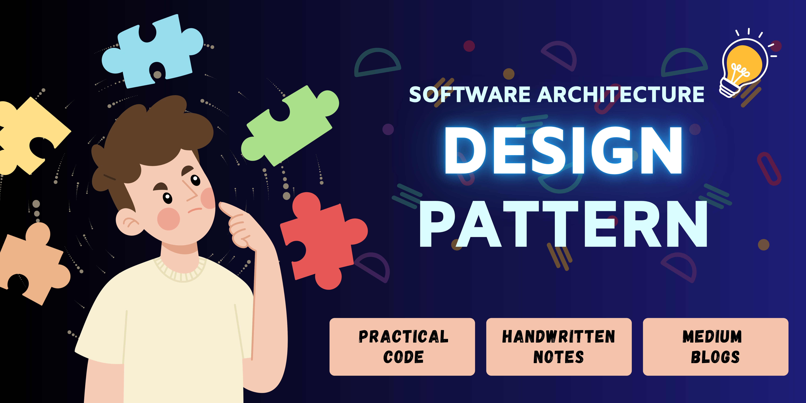

# 🍧 Software-Architecture-and-Design-Pattern 🍧

#### (**[👉 Go To "src" Folder For Resources ](https://github.com/Sumonta056/SWE-322-Software-Architecture-and-Design-Patterns/tree/main/src)**)

#### Website Link  (**[👉Click Here](https://sumonta056.github.io/SWE-322-Software-Architecture-and-Design-Patterns/)**)

## ✍ Blog Written by Me
#### 🧐 SOLID Principles: The Key to Writing Clean &High-Quality Code (**[👉Blog Link](https://medium.com/nerd-for-tech/solid-principles-the-key-to-writing-clean-high-quality-code-9a8f88ea0a8)**)
#### 😲 Factory Design Pattern (**[👉Blog Link](https://medium.com/design-bootcamp/the-factory-design-pattern-ba150444c8a7)**)
#### 🤭 Singleton Design Pattern (**[👉Blog Link](https://medium.com/@sumontasaha80/the-singleton-design-pattern-41f5be69d622)**)
#### 😋 The Observer Design Pattern in Action: A Closer Look at YouTube’s Subscription Notifications (**[👉Blog Link](https://bootcamp.uxdesign.cc/the-observer-design-pattern-in-action-a-closer-look-at-youtubes-subscription-notifications-ca1ca680e560)**)
#### 🤩 Broker Pattern in Action: A Deep Dive into Group Web-Chat Applications (**[👉Blog Link](https://medium.com/design-bootcamp/broker-pattern-in-action-a-deep-dive-into-group-web-chat-applications-c96114bf2feb)**)
#### 😑 Encapsulating Requests: The Power of the “Command Design Pattern”(**[👉Blog Link](https://medium.com/design-bootcamp/encapsulating-requests-the-power-of-the-command-design-pattern-d2f42b0f9d1d)**)
#### 😴 State Design Pattern: Adapting Behavior Based on State (**[👉Blog Link](https://medium.com/design-bootcamp/state-design-pattern-adapting-behavior-based-on-state-a5988d4a1e49)**)
#### 🫠 Building a Browser History Feature: Implementing the Memento Pattern (**[👉Blog Link](https://medium.com/design-bootcamp/building-a-browser-history-feature-implementing-the-memento-pattern-3c9a2fbe62e9)**)
#### 🤫 Visitor Design Pattern: Separating Algorithms from Data Structures (**[👉Blog Link](https://medium.com/gitconnected/visitor-design-pattern-separating-algorithms-from-data-structures-2291cde074a0)**)
#### 🤧 From Messy Code to Masterpiece: The Art of Refactoring and Code Smell Removal (**[👉Blog Link](https://medium.com/gitconnected/from-messy-code-to-masterpiece-the-art-of-refactoring-and-code-smell-removal-b73882918511)**)
️️

## ✍ Topic Covered 

### 😢 Term Test - 1 Syllabus
- UML CLass Diagram and Converting into Code **([👉Click Here](https://github.com/Sumonta056/SWE-322-Software-Architecture-and-Design-Patterns/tree/main/src/HomeWorks/Task_1_Convert_UML_Diagram_Code))**
  - Class Diagram Basics
  - Class Structure
  - Relationship between classes
- Solid Principals **([👉Click Here](https://github.com/Sumonta056/SWE-322-Software-Architecture-and-Design-Patterns/tree/main/src/HomeWorks/Task_2_Solid/Solid_Assignment/Answer))**
  - Single Responsibility Principle (SRP) **([👉Click Here](https://github.com/Sumonta056/SWE-322-Software-Architecture-and-Design-Patterns/tree/main/src/Learning_Design_Patterns/SOLID/SingleResponsibilityPrinciple))**
  - Open/Closed Principle (OCP) **([👉Click Here](https://github.com/Sumonta056/SWE-322-Software-Architecture-and-Design-Patterns/tree/main/src/Learning_Design_Patterns/SOLID/Open_closed_Principle_(OCP)))**
  - Liskov Substitution Principle (LSP) **([👉Click Here](https://github.com/Sumonta056/SWE-322-Software-Architecture-and-Design-Patterns/tree/main/src/HomeWorks/Task_2_Solid/Solid_Assignment/Answer/Liskov_Substitution_Principle_LSP))**
  - Interface Segregation Principle (ISP) **([👉Click Here](https://github.com/Sumonta056/SWE-322-Software-Architecture-and-Design-Patterns/tree/main/src/Learning_Design_Patterns/SOLID/Interface_Segregation_Principle_ISP))**
  - Dependency Inversion Principle (DIP) **([👉Click Here](https://github.com/Sumonta056/SWE-322-Software-Architecture-and-Design-Patterns/tree/main/src/Learning_Design_Patterns/SOLID/Dependency_Inversion_Principle_DIP))**
- Design Patterns
  - Creational Design Pattern  
    - Singleton Design Pattern **([👉Click Here]())**
    - Factory Design Pattern **([👉Click Here](https://github.com/Sumonta056/SWE-322-Software-Architecture-and-Design-Patterns/tree/main/src/Learning_Design_Patterns/FactoryMethod))**
    - Abstract Factory Design Pattern **([👉Click Here](https://github.com/Sumonta056/SWE-322-Software-Architecture-and-Design-Patterns/tree/main/src/Learning_Design_Patterns/AbstractFactoryMethod))**
    - Builder Design Pattern **([👉Click Here](https://github.com/Sumonta056/SWE-322-Software-Architecture-and-Design-Patterns/tree/main/src/Learning_Design_Patterns/BuilderMethod))**
    - Prototype Design Pattern **([👉Click Here](https://github.com/Sumonta056/SWE-322-Software-Architecture-and-Design-Patterns/tree/main/src/Learning_Design_Patterns/PrototypeMethod))**
  - Structural Design Pattern
    - Adapter Design Pattern **([👉Click Here](https://github.com/Sumonta056/SWE-322-Software-Architecture-and-Design-Patterns/tree/main/src/HomeWorks/Task_5_Adapter_Method))**
    - Composite Design Pattern **([👉Click Here](https://github.com/Sumonta056/SWE-322-Software-Architecture-and-Design-Patterns/tree/main/src/Learning_Design_Patterns/composite))**
    - Template Design Pattern **([👉Click Here]())**
    - Proxy Design Pattern **([👉Click Here](https://github.com/Sumonta056/SWE-322-Software-Architecture-and-Design-Patterns/tree/main/src/Learning_Design_Patterns/proxy))**
    - Decorator Design Pattern **([👉Click Here](https://github.com/Sumonta056/SWE-322-Software-Architecture-and-Design-Patterns/tree/main/src/Learning_Design_Patterns/decorator))**
    - Facade Pattern **([👉Click Here](https://github.com/Sumonta056/SWE-322-Software-Architecture-and-Design-Patterns/tree/main/src/Learning_Design_Patterns/facade))** 
    - Flyweight Pattern **([👉Click Here](https://github.com/Sumonta056/SWE-322-Software-Architecture-and-Design-Patterns/tree/main/src/Learning_Design_Patterns/flyweight))**

### 😢 Term Test - 2 Syllabus

  - Behavioral Design Pattern 
    - Strategy Design Pattern **([👉Click Here](https://github.com/Sumonta056/SWE-322-Software-Architecture-and-Design-Patterns/tree/main/src/Learning_Design_Patterns/StrategyPattern))**
    - Chain of Responsibility Pattern **([👉Click Here](https://github.com/Sumonta056/SWE-322-Software-Architecture-and-Design-Patterns/tree/main/src/Learning_Design_Patterns/ChainOfResponsibilityPattern))**
    - Iterator Design Pattern **([👉Click Here](https://github.com/Sumonta056/SWE-322-Software-Architecture-and-Design-Patterns/tree/main/src/Learning_Design_Patterns/IteratorDesignPattern))**
    - Command Design Pattern **([👉Click Here](https://github.com/Sumonta056/SWE-322-Software-Architecture-and-Design-Patterns/tree/main/src/Learning_Design_Patterns/CommandDesignPattern))**
    - State Design Pattern **([👉Click Here](https://github.com/Sumonta056/SWE-322-Software-Architecture-and-Design-Patterns/tree/main/src/Learning_Design_Patterns/StateDesignPattern))**
    - Memento Design Pattern **([👉Click Here](https://github.com/Sumonta056/SWE-322-Software-Architecture-and-Design-Patterns/tree/main/src/Learning_Design_Patterns/MementoPattern))**
    - Observer Design Pattern **([👉Click Here](https://github.com/Sumonta056/SWE-322-Software-Architecture-and-Design-Patterns/tree/main/src/Learning_Design_Patterns/ObserverPattern))**
    - Visitor Design Pattern **([👉Click Here](https://github.com/Sumonta056/SWE-322-Software-Architecture-and-Design-Patterns/tree/main/src/Learning_Design_Patterns/VisitorPattern))**
  
  - Code Smell Refactoring (Clean Code) **([👉Click Here](https://medium.com/gitconnected/from-messy-code-to-masterpiece-the-art-of-refactoring-and-code-smell-removal-b73882918511))**

### 😢 Extra Syllabus : Final 
- Software Architecture
   - Layer Pattern
   - Client - Server Pattern
   - Master - Slave Pattern
   - Pipe - Filter Patter
   - Broker Pattern
   - Peer-to-Peer Pattern
   - Event-Bus Pattern
   - Model-View-Controller Pattern